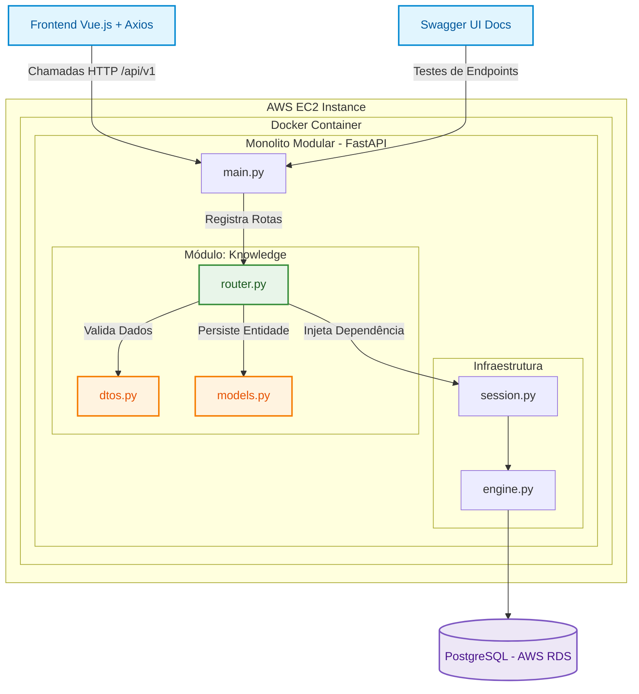

# MemoHub

> Sua base pessoal de conhecimento estruturada em Pergunta → Resposta.

O **MemoHub** é uma aplicação web projetada para centralizar, organizar e recuperar informações importantes com rapidez. Diferente de um aplicativo de notas convencional, o sistema foca no formato pragmático de **Pergunta → Resposta**, funcionando como um repositório dinâmico para dúvidas resolvidas, evitando retrabalho em pesquisas futuras.

---

## Funcionalidades

* **Gerenciamento de Conhecimento:** Criação, leitura, atualização e exclusão (CRUD) de registros.
* **Busca Avançada:** Pesquisa textual por termos contidos no título ou na pergunta.
* **Filtro por Contexto:** Organização e filtragem por categorias de assunto.
* **Favoritos:** Sistema para marcar e desmarcar registros de alta relevância de forma atômica.
* **Ordenação Cronológica:** Listagem automática priorizando registros mais recentes.

---

## Exemplos Práticos

| Categoria | Pergunta | Resposta |
| :--- | :--- | :--- |
| Programação | Como criar uma rota GET utilizando FastAPI? | Utilize o decorador `@app.get()` para definir uma rota que responda às requisições HTTP GET. |
| Culinária | Qual a proporção entre arroz e água? | Geralmente utiliza-se uma medida de arroz para duas medidas de água. |

---

## Stack Tecnológica

### Backend
[Para saber mais](./backend/README.md)

### Frontend
[Para saber mais](./frontend/README.md)

### Infraestrutura & DevOps
[Para saber mais](./backend/README.md)

---

## Arquitetura do Sistema

A aplicação adota o padrão de **Monolito Modular** no backend, mantendo os domínios de negócio isolados em pacotes auto-contidos para facilitar a coesão e simplificar futuras expansões.

---

## Licença e Objetivo

Este projeto possui caráter exclusivamente acadêmico. Ele foi idealizado e construído como ferramenta prática para o domínio do desenvolvimento Full Stack unindo as tecnologias FastAPI, Vue.js, conteinerização isolada com Docker e deploys automatizados na infraestrutura da AWS usando GitHub Actions.
