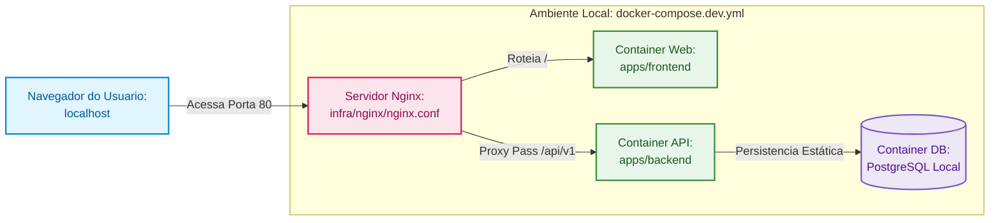
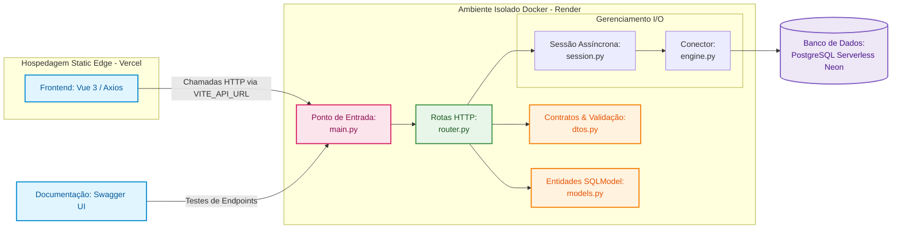

# MemoHub

> Sua base pessoal de conhecimento estruturada em Pergunta → Resposta.

O **MemoHub** é uma aplicação web projetada para centralizar, organizar e recuperar informações importantes com rapidez. Diferente de um aplicativo de notas convencional, o sistema foca no formato pragmático de **Pergunta → Resposta**, funcionando como um repositório dinâmico para dúvidas resolvidas, evitando retrabalho em pesquisas futuras.

---

## Estrutura do Repositório (Monorepo)

O ecossistema adota uma arquitetura de Monorepo unificada, separando os códigos das aplicações, as automações de CI/CD e as configurações estruturais de infraestrutura local e em nuvem.

```text
MemoHub/
├── .github/                 # Estrutura de automação e integração contínua
│   └── workflows/           # Arquivos de esteira de testes e deploys (GitHub Actions)
├── apps/                    # Aplicações do ecossistema
│   ├── backend/             # Código da API (FastAPI em Container Docker)
│   └── frontend/            # Código da interface de usuário (Vue 3 / Vite)
└── infra/                   # Infraestrutura, Orquestração e Configuração
    ├── nginx.conf           # Arquivo de roteamento do servidor local (nginx.conf)
    └── terraform/           # Scripts de automação multicloud PaaS
```

---

## Funcionalidades

* **Gerenciamento de Conhecimento:** Criação, leitura, atualização e exclusão (CRUD) de registros.
* **Busca Avançada:** Pesquisa textual por termos contidos no título ou na pergunta.
* **Filtro por Contexto:** Organização e filtragem por categorias de assunto.
* **Favoritos:** Sistema para marcar e desmarcar registros de alta relevância de forma atômica.
* **Ordenação Cronológica:** Listagem automática priorizando registros mais recentes.

---

## Exemplos Práticos

| Categoria | Pergunta | Resposta |
| :--- | :--- | :--- |
| Programação | Como criar uma rota GET utilizando FastAPI? | Utilize o decorador `@app.get()` para definir uma rota que responda às requisições HTTP GET. |
| Culinária | Qual a proporção entre arroz e água? | Geralmente utiliza-se uma medida de arroz para duas medidas de água. |

---

## Stack Tecnológica e Links de Referência

### Backend
[Para saber mais](./apps/backend/README.md)

### Frontend
[Para saber mais](./apps/frontend/README.md)

### Infraestrutura & DevOps (Terraform)
[Para saber mais](./infra/README.md)

---

## Ambiente de Desenvolvimento Local (Docker Compose & Nginx)

Para fins de desenvolvimento e testes na máquina local, o projeto utiliza um ecossistema totalmente conteinerizado via Docker Compose. Essa arquitetura espelha um Proxy Reverso com **Nginx** na ponta de entrada mapeando as requisições de portas locais e isolando as redes internas.

O fluxo de dados no ambiente de desenvolvimento local opera horizontalmente da seguinte forma:



### Como Executar o Ambiente Local

Certifique-se de possuir o Docker e o Docker Compose instalados na sua máquina. A partir da raiz do monorepo, execute o comando abaixo para construir as imagens e subir os containers em segundo plano:

```bash
docker compose -f docker-compose.dev.yml up --build -d
```

A aplicação estará disponível para acesso no seu navegador através do endereço `http://localhost`.

---

## Arquitetura de Produção e Fluxo de Dados

Quando o código é integrado e enviado para o ambiente de produção, o ecossistema abandona a necessidade de gerenciamento manual de instâncias e proxies locais, migrando para uma topologia baseada em Plataforma como Serviço (PaaS) e Banco de Dados Serverless:



---

## Licença e Objetivo

Este projeto possui caráter exclusivamente acadêmico. Ele foi idealizado e construído como ferramenta prática para o domínio do desenvolvimento Full Stack unindo as tecnologias FastAPI, Vue.js, conteinerização isolada com Docker através do gerenciador de pacotes uv, e automação completa de ambientes multi-plataforma em nuvem com o Terraform.
