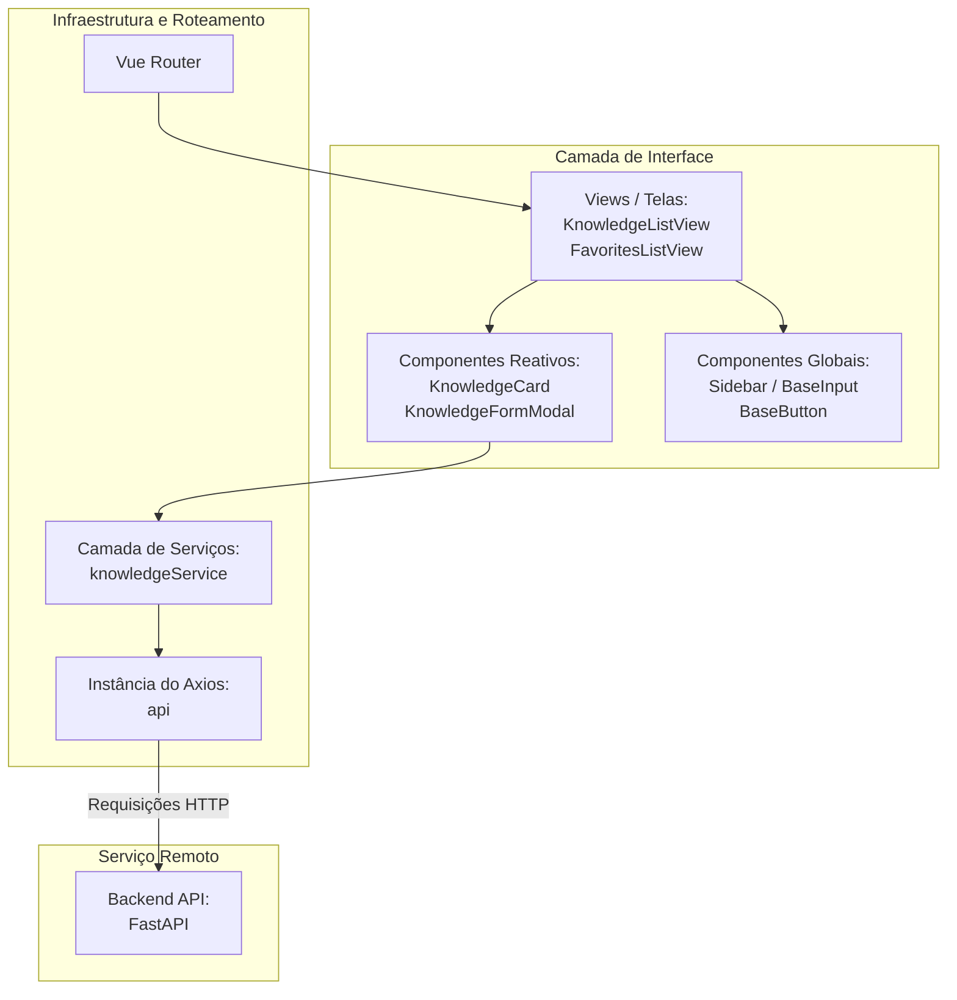

# MemoHub - Frontend Client

> Interface web reativa, desacoplada e componentizada para gerenciamento da sua base de conhecimento.

Este diretório contém o código-fonte do ecossistema de frontend do **MemoHub**, desenvolvido sob a arquitetura de **Monólito Modular** utilizando **Vue 3** com a sintaxe moderna de **Composition API** e **TypeScript**. A interface consome de forma assíncrona os serviços da API REST do backend, organizando os dados de forma fluida no conceito de **Pergunta → Resposta**.

---

## Arquitetura e Estrutura de Pastas

O projeto utiliza uma divisão baseada em módulos independentes por domínio de negócio, mantendo o núcleo da aplicação (`core`) isolado e as funcionalidades de negócios encapsuladas em suas próprias estruturas contextuais.

```text
src/
├── core/
│   ├── components/
│   │   ├── BaseButton.vue
│   │   ├── BaseInput.vue
│   │   └── Sidebar.vue
│   ├── router/
│   │   └── index.ts
│   └── services/
│       └── api.ts
├── modules/
│   ├── knowledge/
│   │   ├── components/
│   │   │   ├── KnowledgeCard.vue
│   │   │   └── KnowledgeFormModal.vue
│   │   ├── services/
│   │   │   └── knowledgeService.ts
│   │   ├── views/
│   │   │   ├── FavoritesListView.vue
│   │   │   └── KnowledgeListView.vue
│   │   └── types.ts
│   └── landing-page/
│       ├── components/
│       │   ├── FeaturesSection.vue
│       │   └── HeroSection.vue
│       └── views/
│           └── HomeView.vue
├── App.vue
├── main.ts
└── style.css
```

---

## Fluxo da Arquitetura do Sistema

O diagrama abaixo detalha o fluxo de dados desde a interface consumida pelo usuário, passando pela camada de serviços e roteamento até atingir os endpoints HTTP do backend FastAPI.



---

## Tecnologias Utilizadas

- **Framework Principal:** Vue 3 (Composition API)
- **Compilador e Build Tool:** Vite (Otimização assíncrona e Hot Module Replacement)
- **Superset de Linguagem:** TypeScript (Tipagem estrita e DTOs correspondentes ao backend)
- **Estilização e Design System:** Tailwind CSS v4 (Design tokens globais e utilitários nativos)
- **Biblioteca de Ícones:** `@lucide/vue` (Ícones vetoriais leves)
- **Cliente HTTP:** Axios (Comunicação assíncrona baseada em Promises)
- **Ecossistema de Testes:** Vitest, `@vue/test-utils`, `jsdom` e `msw` (Mock Service Worker)

---

## Execução de Testes Automatizados

O ecossistema de testes do frontend é dividido estrategicamente em duas suítes independentes rodando sobre o motor do **Vitest**.

### 1. Testes Unitários
Focados em testar o comportamento de funções isoladas e componentes visuais de forma pura. Os elementos externos (como o roteador e chamadas HTTP) são mockados por meio de espelhos (`vi.mock`).
- **Arquivos testados:** `BaseButton.spec.ts`, `BaseInput.spec.ts`, `Sidebar.spec.ts`, `KnowledgeCard.spec.ts`, `KnowledgeFormModal.spec.ts` e `knowledgeService.spec.ts`.
- **Comando para execução contínua (Watch):**
```bash
npm run test:unit
```

### 2. Testes de Integração
Validam o comportamento integrado das telas completas (Views), simulando fluxos de rede idênticos aos do usuário final. Utiliza a biblioteca **MSW (Mock Service Worker)** para interceptar todas as requisições disparadas pelo Axios para o endereço `http://localhost:8000/api/v1/` e devolver respostas idênticas às do backend real, sem precisar ligar serviços ou bancos de dados.
- **Arquivos testados:** `KnowledgeListView.integration.spec.ts` e `FavoritesListView.integration.spec.ts`.
- **Comando para execução única em Pipeline (Single Run):**
```bash
npm run test:ci
```

---

## Como Executar o Projeto Localmente

### Pré-requisitos
Certifique-se de possuir o **Node.js** (versão 18+) e o **npm** instalados na sua máquina Ubuntu.

### 1. Clonar e Acessar o Diretório do Frontend
```bash
cd frontend/
```

### 2. Configurar as Variáveis de Ambiente
Crie o arquivo local `.env` a partir do modelo existente:
```bash
cp .env.example .env
```
Certifique-se de que a variável aponta para o endereço correto do backend:
```ini
VITE_API_URL=http://localhost:8000
```

### 3. Instalar as Dependências
```bash
npm install
```

### 4. Executar o Servidor de Desenvolvimento
```bash
npm run dev
```
A aplicação estará disponível localmente no seu navegador através do endereço `http://localhost:5173/`.
