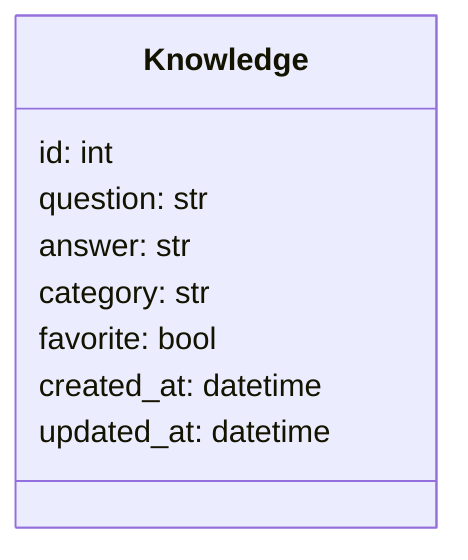

# MemoHub - Backend API

> Camada de serviços assíncronos e persistência da sua base pessoal de conhecimento.

Este diretório contém o código-fonte do ecossistema de backend do **MemoHub**, estruturado sob a arquitetura de **Monolito Modular** com **Python** e **FastAPI**. A aplicação centraliza informações importantes em um formato otimizado de **Pergunta → Resposta**, permitindo rápido armazenamento e reutilização de dados.

---

## Arquitetura e Estrutura de Pastas

O projeto utiliza pacotes de domínio encapsulados para garantir alta coesão, baixo acoplamento e isolamento de escopo por contexto de negócio.

```text
src/
├── config/
│   └── env.py
├── infra/
│   └── db/
│       ├── engine.py
│       ├── session.py
│       └── schema.py
├── modules/
│   └── knowledge/
│       ├── dtos.py
│       ├── models.py
│       └── router.py
└── main.py
```

---

## Diagrama de Classes (Domínio de Negócio)



---

## Tecnologias Utilizadas

- **Linguagem Principal:** Python 3.12+
- **Framework Web:** FastAPI (Totalmente Assíncrono)
- **Mapeamento Objeto-Relacional (ORM):** SQLModel (Fusão entre SQLAlchemy e Pydantic)
- **Driver de Banco de Dados:** asyncpg (Operações I/O não bloqueantes para PostgreSQL)
- **Gerenciador de Pacotes:** uv (Gerenciador ultrarrápido de dependências Python)

---

## Modelo de Dados

### Tabela: `knowledge`

| Campo | Tipo | Descrição |
| :--- | :--- | :--- |
| **id** (PK) | Integer | Identificador único gerado automaticamente (`autoincrement`) |
| **question** | Text | Pergunta detalhada sobre o assunto |
| **answer** | Text | Resposta explicativa |
| **category** | String(100) | Nome do grupo ou categoria de conhecimento |
| **favorite** | Boolean | Marcador lógico de preferência |
| **created_at** | Timestamp | Data e hora de criação do registro |
| **updated_at** | Timestamp | Data e hora da última modificação |

---

## Como Executar o Projeto Localmente

### Pré-requisitos
Certifique-se de possuir o **PostgreSQL** instalado e ativo, ou uma instância rodando via Docker, mapeando o fuso horário sem fuso horário estrito (`TIMESTAMP WITHOUT TIME ZONE`).

### 1. Clonar e Acessar o Diretório
```bash
git checkout docs/backend-documentation
cd backend/
```

### 2. Instalar as Dependências com o Gerenciador `uv`
```bash
uv sync
```

### 3. Executar o Servidor de Desenvolvimento (Uvicorn)
```bash
uv run uvicorn src.main:app --reload
```
A API estará disponível em `http://127.0.0.1:8000` e a documentação interativa Swagger UI estará acessível em `http://127.0.0`.

---

## API REST Endpoints

Todos os endpoints estão prefixados sob o namespace global `/api/v1`.

| Método | Endpoint | Parâmetros Opcionais (Query) | Descrição |
| :--- | :--- | :--- | :--- |
| **GET** | `/knowledge/` | `search: str`, `category: str` | Lista os conhecimentos ativos de forma ordenada |
| **GET** | `/knowledge/{id}`| — | Busca uma entrada específica por identificador único |
| **POST** | `/knowledge/` | — | Cria um novo registro de Pergunta → Resposta |
| **PUT** | `/knowledge/{id}`| — | Atualiza todos os campos de um registro existente |
| **PATCH**| `/knowledge/{id}/favorite` | — | Inverte o estado de favoritação lógico do registro |
| **DELETE**| `/knowledge/{id}`| — | Exclui fisicamente a linha do banco de dados |
