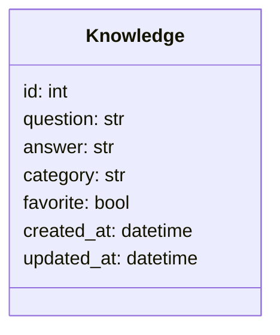

# MemoHub - Backend API

> Camada de serviços assíncronos e persistência da sua base pessoal de conhecimento.

Este diretório contém o código-fonte do ecossistema de backend do **MemoHub**, estruturado sob a arquitetura de **Monolito Modular** com **Python** e **FastAPI**. A aplicação centraliza informações importantes em um formato otimizado de **Pergunta → Resposta**, permitindo rápido armazenamento e reutilização de dados.

---

## Arquitetura e Estrutura de Pastas

O projeto utiliza pacotes de domínio encapsulados para garantir alta coesão, baixo acoplamento e isolamento de escopo por contexto de negócio, separando as rotas HTTP da camada lógica de banco de dados por meio de serviços.

```text
src/
├── config/
│   └── env.py
├── infra/
│   └── db/
│       ├── migrations/
│       ├── engine.py
│       ├── session.py
│       └── schema.py
├── modules/
│   └── knowledge/
│       ├── dtos.py
│       ├── models.py
│       ├── service.py
│       └── router.py
└── main.py
tests/
├── integration/
│   └── modules/
│       └── knowledge/
│           └── test_router_integration.py
├── unit/
│   └── modules/
│       └── knowledge/
│           └── test_service_unit.py
└── conftest.py
```

---

## Diagrama de Classes (Domínio de Negócio)



---

## Tecnologias Utilizadas

- **Linguagem Principal:** Python 3.12+
- **Framework Web:** FastAPI (Totalmente Assíncrono)
- **Mapeamento Objeto-Relacional (ORM):** SQLModel (Fusão entre SQLAlchemy e Pydantic)
- **Gerenciamento de Migrações:** Alembic (Controle assíncrono de versões do banco de dados)
- **Driver de Banco de Dados:** asyncpg (Operações I/O não bloqueantes para PostgreSQL)
- **Gerenciador de Pacotes:** uv (Gerenciador ultrarrápido de dependências Python)
- **Ferramentas de Teste:** Pytest, pytest-asyncio, HTTPX e aiosqlite

---

## Modelo de Dados

### Tabela: `knowledge`

| Campo | Tipo | Descrição |
| :--- | :--- | :--- |
| **id** (PK) | Integer | Identificador único gerado automaticamente (`autoincrement`) |
| **question** | Text | Pergunta detalhada sobre o assunto |
| **answer** | Text | Resposta explicativa |
| **category** | String(100) | Nome do grupo ou categoria de conhecimento |
| **favorite** | Boolean | Marcador lógico de preferência |
| **created_at** | Timestamp | Data e hora de criação do registro (Sem Timezone / UTC) |
| **updated_at** | Timestamp | Data e hora da última modificação (Sem Timezone / UTC) |

---

## Como Executar o Projeto Localmente

### Pré-requisitos
Certifique-se de possuir o **PostgreSQL** instalado e ativo, mapeando o fuso horário sem fuso horário estrito (`TIMESTAMP WITHOUT TIME ZONE`), ou utilize o ambiente pré-configurado via Docker Compose.

### 1. Acessar o Diretório e Instalar Dependências
```bash
cd backend/
uv sync
```

### 2. Executar e Controlar as Migrações de Banco (Alembic)
Para aplicar o histórico estrutural de tabelas no seu banco de dados PostgreSQL ativo, execute:
```bash
uv run alembic upgrade head
```

### 3. Executar o Servidor de Desenvolvimento (Uvicorn)
```bash
uv run uvicorn src.main:app --reload
```
A API estará disponível em `http://127.0.0.1:8000` e a documentação interativa Swagger UI estará acessível em `http://127.0.0`.

---

## Execução de Testes Automatizados

As configurações e caminhos de execução do interpretador de testes estão centralizados no arquivo `pyproject.toml`.

### Testes Unitários
Focados no isolamento completo da camada lógica de negócios (`KnowledgeService`) utilizando objetos simulados (mocks) do banco de dados:
```bash
uv run pytest tests/unit/
```

### Testes de Integração
Validam o fluxo completo das rotas HTTP simulando requisições contra os endpoints do FastAPI utilizando uma base de dados assíncrona temporária em memória SQLite (`aiosqlite`):
```bash
uv run pytest tests/integration/
```

---

## API REST Endpoints

Todos os endpoints estão prefixados sob o namespace global `/api/v1`.

| Método | Endpoint | Parâmetros Opcionais (Query) | Descrição |
| :--- | :--- | :--- | :--- |
| **GET** | `/knowledge/` | `search: str`, `category: str`, `favorite: bool` | Lista e filtra os conhecimentos ativos de forma cronológica inversa |
| **GET** | `/knowledge/{id}`| — | Busca uma entrada específica por identificador único |
| **POST** | `/knowledge/` | — | Cria um novo registro de Pergunta → Resposta |
| **PUT** | `/knowledge/{id}`| — | Atualiza os campos de dados de um registro preservando a data de criação |
| **PATCH**| `/knowledge/{id}/favorite` | — | Inverte atomicamente o estado de favoritação lógico do registro |
| **DELETE**| `/knowledge/{id}`| — | Exclui fisicamente a linha correspondente do banco de dados |
