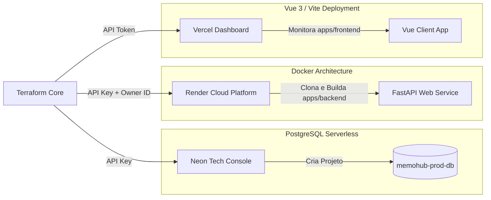

# MemoHub - Infrastructure as Code (Terraform)

> Camada de orquestração modular, provisionamento e automação da infraestrutura em nuvem.

Este diretório contém o código-fonte dos arquivos de configuração do **Terraform** do **MemoHub**, estruturado sob o conceito de **Infraestrutura como Código (IaC)**. A automação gerencia o ciclo de vida de todo o ecossistema multi-plataforma de servidores e bancos de dados de forma previsível e isolada.

---

## Estrutura de Pastas e Módulos

O projeto utiliza uma arquitetura modularizada para isolar os provedores de nuvem por contextos de responsabilidade técnica, separando as chaves de API globais das configurações internas de recursos de cada plataforma.

```text
modules/
├── neon/
│   ├── main.tf
│   ├── outputs.tf
│   └── variables.tf
├── render/
│   ├── main.tf
│   ├── outputs.tf
│   └── variables.tf
└── vercel/
    ├── main.tf
    ├── outputs.tf
    └── variables.tf
main.tf
providers.tf
variables.tf
terraform.tfvars
```

---

## Fluxo de Orquestração da Infraestrutura

O diagrama abaixo detalha a sequência lógica de criação executada pelo Terraform para construir a topologia do sistema. A saída de dados de um módulo alimenta diretamente os parâmetros de entrada do próximo, estabelecendo uma esteira de dependências lineares disposta horizontalmente.

```mermaid
graph LR
    subgraph Contexto_Raiz [Arquivos Globais de Configuração]
        TFVARS[Chaves Ocultas:<br/>terraform.tfvars]
        VARS[Definição de Variáveis:<br/>variables.tf]
        PROV[Provedores de Nuvem:<br/>providers.tf]
        MAIN[Orquestrador Global:<br/>main.tf]
    end

    subgraph Modulo_Database [Camada de Dados]
        NeonDB[Modulo Neon:<br/>modules/neon/main.tf]
        URI[Output:<br/>connection_string]
    end

    subgraph Modulo_Backend [Camada de API]
        RenderAPI[Modulo Render:<br/>modules/render/main.tf]
        URL_API[Output:<br/>service_url]
    end

    subgraph Modulo_Frontend [Camada de Interface]
        VercelWeb[Modulo Vercel:<br/>modules/vercel/main.tf]
    end

    TFVARS --> VARS
    VARS --> PROV
    PROV --> MAIN
    MAIN --> NeonDB
    NeonDB -->|Exporta Conexão| URI
    URI -->|Substitui Prefixo postgresql+asyncpg| RenderAPI
    RenderAPI -->|Exporta Endpoints| URL_API
    URL_API -->|Injeta VITE_API_URL e Liga Git| VercelWeb
```



---

## Arquitetura de Deploys Gerenciada

O diagrama de blocos abaixo descreve como o Terraform se comunica com as APIs das plataformas PaaS e Serverless para provisionar o ambiente físico final de produção na internet.



---

## Tecnologias e Provedores Utilizados

- **Orquestrador Central:** Terraform CLI 1.8.0+
- **Provedor de Banco de Dados:** kislerdm/neon (Gerenciamento de projetos PostgreSQL Serverless)
- **Provedor de Servidor de API:** render-oss/render (Provisionamento de serviços baseados em containers Docker)
- **Provedor de Hospedagem Web:** vercel/vercel (Gerenciamento de ambientes estáticos e variáveis de injeção client-side)

---

## Pré-requisitos e Credenciais

Para executar os planos locais, você deve criar um arquivo de variáveis reais nomeado exatamente como `terraform.tfvars` dentro deste diretório. Este arquivo está catalogado no `.gitignore` raiz e não deve ser enviado ao repositório público.

### Estrutura do Arquivo: `terraform.tfvars`

```hcl
neon_api_key      = "SUA_API_KEY_DO_NEON"
render_api_key    = "SUA_API_KEY_DO_RENDER"
vercel_api_token  = "SUA_API_KEY_DA_VERCEL"
github_repository = "rubensrabelo/MemoHub"
render_owner_id   = "tea-SEU_WORKSPACE_ID_DO_RENDER"
```

Nota: O `render_owner_id` representa o ID de Workspace do Render e deve ser coletado diretamente através da URL do painel logado no seu navegador.

---

## Guia de Operação (Ciclo de Vida)

Você pode gerenciar a infraestrutura de forma automatizada através dos scripts unificados ou manualmente executando comando por comando.


### Opção 1: Operação Automatizada (Via Scripts)

Sempre execute os comandos a partir da **raiz do projeto**.

#### Como subir ou atualizar a infraestrutura
```bash
# Concede permissão de execução (necessário apenas na primeira vez)
chmod +x scripts/deploy.sh

# Executa o ciclo completo (init, fmt, validate, plan, apply e outputs)
./scripts/deploy.sh
```

#### Como destruir e limpar o ambiente
```bash
# Concede permissão de execução (necessário apenas na primeira vez)
chmod +x scripts/destroy.sh

# Remove todos os recursos da nuvem e expurga os arquivos gerados
./scripts/destroy.sh
```

---

### Opção 2: Operação Manual Passo a Passo

Sempre entre no diretório específico antes de iniciar: `cd infra/terraform/`.

#### Como SUBIR ou ATUALIZAR a Infraestrutura (Idêntico ao script)
Utilize esta sequência estruturada para garantir a formatação correta, validação de sintaxe e o provisionamento unificado:

```bash
# Inicializa o projeto baixando os pacotes e provedores oficiais
terraform init

# Formata recursivamente todos os arquivos de configuração (.tf)
terraform fmt -recursive

# Valida a integridade da sintaxe e a semântica do código
terraform validate

# Gera o plano de execução salvo
terraform plan -out=tfplan

# Executa o deploy integrado utilizando o plano gerado
terraform apply tfplan

# Obtém e exibe as URLs de produção limpas (sem aspas)
terraform output -raw render_backend_url
terraform output -raw vercel_frontend_url
```

#### Como DESTRUIR e Limpar o Ambiente (Idêntico ao script)
Para remover integralmente todos os recursos alocados nas plataformas de nuvem e purgar todos os artefatos residuais locais, execute:

```bash
# Inicializa para garantir o mapeamento do backend
terraform init

# Gera o plano de destruição estruturado
terraform plan -destroy -out=destroy.tfplan

# Executa a remoção do banco Neon, container do Render e projeto Vercel
terraform apply destroy.tfplan

# Remove todos os arquivos temporários e estados gerados localmente
rm -f tfplan destroy.tfplan
rm -rf .terraform
rm -f .terraform.lock.hcl
rm -f terraform.tfstate
rm -f terraform.tfstate.backup
```

---

## Visualizando as URLs de Produção via Terminal

Após a validação final do deploy, você pode inspecionar e extrair os endereços gerados dinamicamente pelas plataformas utilizando as variáveis globais de saída expostas:

```bash
# Imprime o link público do Front-end gerado pela Vercel
terraform output vercel_frontend_url

# Imprime o link público da API Python gerado pelo Render
terraform output render_backend_url
```
